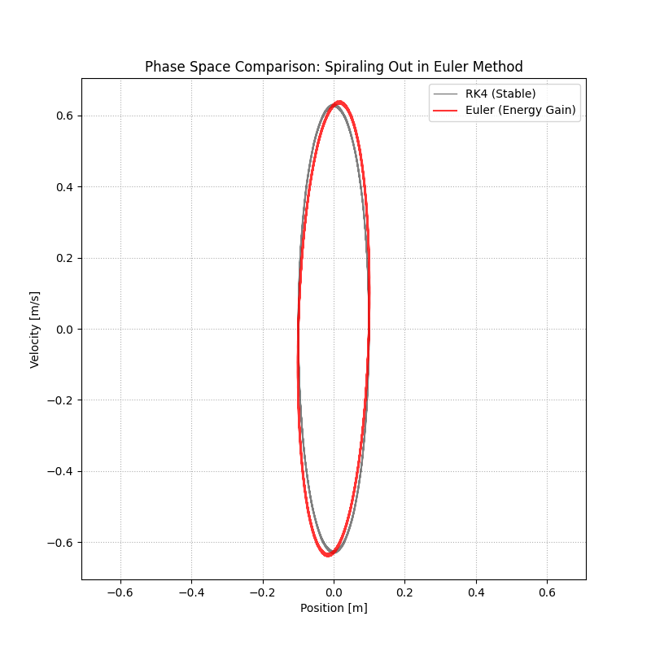

# harmonic-oscillator-simulation
## 概要
物理の基本的な運動である単振動を、二つのアルゴリズムで数値シミュレーションするプログラムです。
C++で計算された結果がCSVファイルに保存され、そのデータを元にpythonでグラフ化しています。
アルゴリズムはシンプルな前進オイラー法と高精度なルンゲクッタ法を使用しました。

## 実行結果
<html>
  
  
</html>

